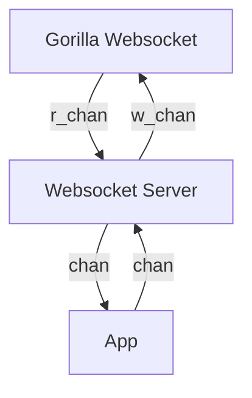

### Messages in channels:

Websocket Server to App:

- Player connected
- Player sent message
- Player disconnected

App to Websocket Server:

- Emit message to player
- Disconnect player

r_chan:

- Player sent bytes

w_chan:

- Send bytes to player
